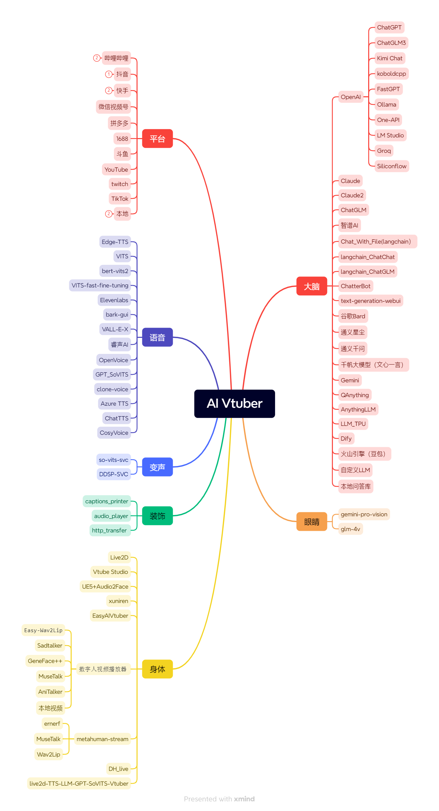
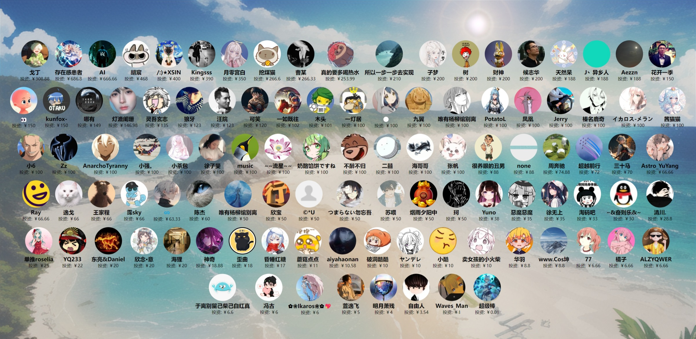

# ✨ Luna AI ✨

<a href="https://app.fossa.com/projects/git%2Bgithub.com%2FIkaros-521%2FAI-Vtuber?ref=badge_shield&issueType=license" alt="FOSSA Status"></a>
<a href="//github.com/Ikaros-521/AI-Vtuber/stargazers"></a>
<a href="//github.com/Ikaros-521/AI-Vtuber/issues"></a>
<a href="//github.com/Ikaros-521/AI-Vtuber/network"></a>
<a href="//www.python.org"></a>

`Luna AI` 是一款结合了最先进技术的虚拟AI主播。它的核心是一系列高效的人工智能模型，包括 `ChatterBot、GPT、Claude、langchain、chatglm、text-generation-webui、讯飞星火、智谱AI、谷歌Bard、文心一言、通义星尘、通义千问、千帆大模型、Gemini、Kimi Chat、QAnything、koboldcpp`。这些模型既可以在本地运行，也可以通过云端服务提供支持。

`Luna AI` 的外观由 `Live2D、Vtube Studio、xuniren、UE5 结合 Audio2Face、EasyAIVtuber、数字人视频播放器（Easy-Wav2Lip）` 技术打造，为用户提供了一个生动、互动的虚拟形象。这使得 `Luna AI` 能够在各大直播平台，如 `Bilibili、抖音、快手、微信视频号、斗鱼、YouTube、Twitch 和 TikTok`，进行实时互动直播。当然，它也可以在本地环境中与您进行个性化对话。

为了使交流更加自然，`Luna AI` 使用了先进的自然语言处理技术，结合文本转语音系统，如 `Edge-TTS、VITS-Fast、elevenlabs、bark-gui、VALL-E-X、睿声AI、genshinvoice.top、tts.ai-lab.top、OpenVoice、GPT_SoVITS、clone-voice、Azure TTS`。这不仅让它能够生成流畅的回答，还可以通过 `so-vits-svc 和 DDSP-SVC` 实现声音的变化，以适应不同的场景和角色。

此外，`Luna AI` 还能够通过特定指令与 `Stable Diffusion` 协作，展示画作。用户还可以自定义文案，让 Luna AI 循环播放，以满足不同场合的需求。

```
本项目完全免费，如有发现一模一样的套壳售卖程序，皆为盗版，请及时止损
```

<a href="//space.bilibili.com/3709626/channel/collectiondetail?sid=1422512" target="_blank">▶︎ 视频教程合集</span></a>
<span> | </span>
<a href="//luna.docs.ie.cx">📄 在线文档</span></a>
<span> | </span>
<a href="//github.com/Ikaros-521/AI-Vtuber" target="_blank">🍉 GitHub</span></a>
<span> | </span>
<a href="//gitee.com/ikaros-521/AI-Vtuber" target="_blank">🍓 Gitee</span></a>
<span> | </span>
<a href="http://qm.qq.com/cgi-bin/qm/qr?_wv=1027&k=OKS2QoO3u6_cqGUOJW1hIL8ns3Ijo4Uo&authKey=FnLILD1N8VURDr4NVH0KEttxigdLxCILVnpJU2F33AsoMK8eR9f%2BLfJgEjvvMn8O&noverify=0&group_code=587663288" target="_blank">🐧 粉丝Q群（密码请看视频）</span></a>




## 🀅开发&项目相关

### 简易流程图


## License

[](https://app.fossa.com/projects/git%2Bgithub.com%2FIkaros-521%2FAI-Vtuber?ref=badge_large&issueType=license) 

## ⭐️Star 经历

[](https://star-history.com/#Ikaros-521/AI-Vtuber&Date)

## 🤝贡献

### 🎉鸣谢

感谢以下开发者对该项目做出的贡献：

<a href="https://github.com/Ikaros-521/AI-Vtuber/graphs/contributors">
  
</a>

### 💸投资方



### 合作伙伴

青椒云：[qingjiaocloud.com](https://account.qingjiaocloud.com/signin?inviteCode=4Q92ROBQ)  ———— AIGC 高性能云桌面  

睿声AI：[reecho.ai](https://www.reecho.ai/)  ———— 瞬时创建 超级拟真的 人工智能克隆语音  

### 🙌赞助

<div>
  
  
</div>
